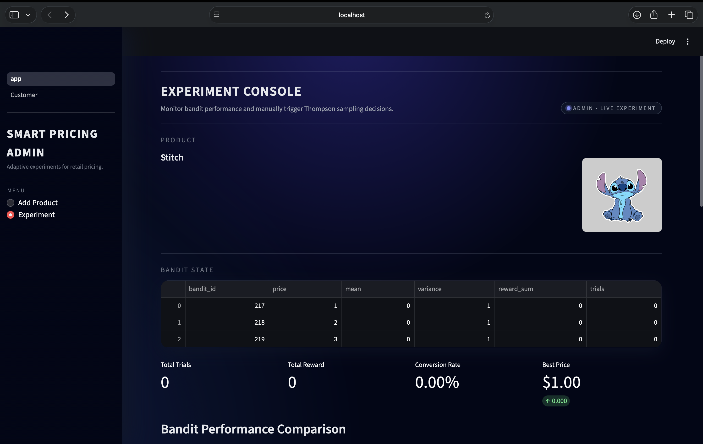

# Smart Pricing Playground  
Group 7

**Authors:**  
- Arevik Melikyan — PM/PO  
- Zhanna Balyan — DB Developer  
- Sona Barseghyan — Backend/API Developer  
- Edelveys Gevorgyan — Frontend Developer  
- Elen Ghalechyan — Data Science  


**Created:** 09/12/2025

---

##  Documentation  
For a more detailed documentation check : 

---

#  Project Overview  

Smart Pricing Playground is an end-to-end platform for running adaptive pricing experiments using Thompson Sampling.  
The system supports:

- Defining products with multiple price variants  
- Displaying an offer page to customers  
- Collecting buy/no-buy outcomes  
- Automatically learning which price performs best  
- Admin dashboard for experiment monitoring  
- Posterior distributions and KPI visualization  

The system includes:

-  **Backend API (Flask)** — users, projects, bandits, experiments, algorithm endpoints  
-  **DS Service** — Gaussian Thompson Sampling implementation  
-  **Core Service** — initializes database tables  
-  **Frontend (Streamlit)** — dashboard for running pricing experiments  
-  **PostgreSQL Database**  
-  **pgAdmin** for DB administration  

This architecture allows the pricing engine to run in real time and scale independently across services.

---

#  Installation

### 1. Clone repository
```bash
git clone https://github.com/DS-223-2025-Fall/group-7.git
cd smart_pricing
```

### 2. Add `.env`
Create `.env` with:

```
DB_USER=postgres
DB_PASSWORD=admin
DB_NAME=postgres
DB_HOST=db
DB_PORT=5432
PGADMIN_EMAIL=admin@admin.com
PGADMIN_PASSWORD=admin
```

### 3. Build & Run Services
```bash
docker compose up --build
```

---

#  Access the Application

After running Docker, access:

###  Streamlit Frontend
**http://localhost:8501**  
Main dashboard for pricing experiments.

###  Backend API (Flask)
**http://localhost:8000**  
Swagger-like description available via endpoints.

###  DS Service
**http://localhost:8888**  
Handles Gaussian Thompson Sampling.

###  pgAdmin (Database GUI)
**http://localhost:5050**  
Login using `.env` credentials.

---

### 4. Stopping the Application
```bash
docker compose down
```

#  Project Structure

```
smart_pricing/
│
├── backend/
│   ├── Dockerfile
│   ├── requirements.txt
│   ├── endpoints.py
│   ├── __init__.py
│   │
│   ├── database/
│   │   ├── __init__.py
│   │   ├── database.py
│   │   ├── models.py
│   │   └── schema.py
│   │
│   ├── models/
│   │   ├── __init__.py
│   │   ├── Request/
│   │   │   ├── __init__.py
│   │   │   └── requests.py
│   │   └── Response/
│   │       ├── __init__.py
│   │       └── responses.py
│   │
│   └── images/
│
├── core/
│   ├── Dockerfile
│   ├── requirements.txt
│   ├── __init__.py
│   ├── .env
│   ├── config.py
│   ├── init_db.py
│   └── models.py
│
├── ds/
│   ├── Dockerfile
│   ├── requirements.txt
│   ├── __init__.py
│   │
│   ├── database/
│   │   ├── database.py
│   │   └── models.py
│   │
│   ├── thompson.ipynb
│   └── .env
│
├── frontend/
│   ├── Dockerfile
│   ├── requirements.txt
│   ├── app.py
│   ├── __init__.py
│   │
│   ├── pages/
│   │   ├── __init__.py
│   │   └── Customer.py
│   │
│   └── assets/
│
├── docker-compose.yml
├── .env
```

---

# Core Service

The **Core** microservice is responsible for initializing all database tables and preparing the system for use.  
It runs automatically when the application starts and ensures that all required tables exist before the backend and frontend begin working.

### Tables created by Core:
- **user**
- **projects**
- **bandits**
- **experiments**

All tables are created using SQLAlchemy:

```python
Base.metadata.create_all(engine)
```

---

# Data Science (Thompson Sampling)

The DS service implements the Gaussian Thompson Sampling engine used for simulation, testing, and visualization. It communicates directly with the shared PostgreSQL database and uses the same SQLAlchemy models as the backend.

The DS component is responsible for:
- creating projects and bandits for offline experiments
- selecting the best bandit using Gaussian Thompson Sampling
- updating bandit parameters based on rewards
- running large-scale simulations
- plotting posterior distributions of each bandit

Each bandit maintains:
- mean
- precision (lambda)
- total reward (sum_x)
- number of trials

Sampling rule:
A bandit is sampled from a normal distribution with:
mean = bandit.mean
std = 1 / sqrt(lambda)

The bandit with the highest sampled value is selected.

Posterior update rule:
lambda_new = lambda_old + 1
sum_x_new = sum_x_old + reward
mean_new = sum_x_new / lambda_new

The DS engine can run many simulated trials to observe how Thompson Sampling converges toward the best price option. It can also generate posterior distribution plots to visualize the learning process.

This service is mainly used for analysis, experimentation, and model validation rather than real-time API interaction.


# API (FastAPI Backend)

The Backend service exposes a REST API that manages projects, bandits, Thompson Sampling decisions, and reward submission. It communicates with PostgreSQL through SQLAlchemy and provides JSON responses for the frontend.

All API endpoints are available through Swagger UI at:
http://localhost:8000/docs

The backend is responsible for:
- creating products (projects)
- adding price variants (bandits)
- selecting a price using Thompson Sampling
- recording buy / no-buy outcomes
- returning analytics data to the frontend


---

## Project Endpoints

POST /projects
Creates a new project. Requires:
- description
- number of bandits

GET /projects
Returns a list of all projects with metadata.

GET /projects/{project_id}
Returns detailed information about a single project.

POST /projects/{project_id}/upload-image
Uploads a product image to backend/images and stores its path in the database.

---

## Bandit Endpoints

POST /projects/{project_id}/bandits
Creates a new bandit (price variant) under a project.

GET /projects/{project_id}/bandits
Returns all bandits of a project including:
- bandit_id
- price
- mean
- variance
- reward_sum
- trials

---

## Thompson Sampling Endpoints

POST /projects/{project_id}/thompson/select
Runs Gaussian Thompson Sampling for the given project.
Returns:
- selected bandit_id
- selected price
- reason (optional)

This is used both by the Admin UI and the Customer page.

POST /bandits/{bandit_id}/thompson/reward
Records a reward event (buy or no-buy) and updates the bandit's:
- mean
- variance (precision)
- reward_sum
- trials

Also inserts an Experiment record into the database.

---

## Experiment Data

Each reward submission creates a new database entry that stores:
- project_id
- bandit_id
- reward value
- decision (buy / no-buy)
- timestamp

These records are used by the Admin UI to compute:
- total reward
- conversion rate
- best-performing price
- charts and visualizations

---

## Static Files

Product images are served via:
GET /images/{filename}

The backend automatically mounts the images directory.

---

# Docker Services

### Database
```yaml
db:
    container_name: postgresql_db
    image: postgres:16
    restart: always
    ports:
      - "5432:5432"
    environment:
      POSTGRES_USER: ${DB_USER}
      POSTGRES_PASSWORD: ${DB_PASSWORD}
      POSTGRES_DB: ${DB_NAME}
    healthcheck:
      test: ["CMD-SHELL", "pg_isready -U ${DB_USER}"]
      interval: 5s
      timeout: 5s
      retries: 5
    volumes:
      - ./postgres_data:/var/lib/postgresql/data
```

### pgAdmin
```yaml
pgadmin:
    container_name: pgadmin
    image: dpage/pgadmin4
    environment:
      - PGADMIN_DEFAULT_EMAIL=${PGADMIN_EMAIL}
      - PGADMIN_DEFAULT_PASSWORD=${PGADMIN_PASSWORD}
    ports:
      - "5050:80"
    volumes:
      - ./pgadmin_data:/var/lib/pgadmin
    depends_on:
      - db
    user: "0:0"
```

### Backend
```yaml
backend:
    container_name: backend
    build:
      context: .
      dockerfile: backend/Dockerfile
    depends_on:
      core:
        condition: service_completed_successfully
    ports:
      - "8000:8000"
    environment:
      DB_USER: ${DB_USER}
      DB_PASSWORD: ${DB_PASSWORD}
      DB_NAME: ${DB_NAME}
      DB_HOST: db
      DB_PORT: 5432
    volumes:
      - ./backend:/backend
      - ./backend/images:/backend/images
```

### DS
```yaml
ds:
    container_name: ds
    build:
      context: ./ds
      dockerfile: Dockerfile
    ports:
      - "8888:8888"
    volumes:
      - ./ds:/ds
    env_file:
      - .env
    depends_on:
      db:
        condition: service_healthy
```

### core
```yaml
core:
    container_name: core
    build:
      context: .
      dockerfile: core/Dockerfile
    depends_on:
      db:
        condition: service_healthy
    restart: "no"
    environment:
      DB_USER: ${DB_USER}
      DB_PASSWORD: ${DB_PASSWORD}
      DB_NAME: ${DB_NAME}
      DB_HOST: db
      DB_PORT: 5432
```

### Frontend
```yaml
frontend:
    container_name: frontend
    build:
      context: .
      dockerfile: frontend/Dockerfile
    depends_on:
      - backend
    ports:
      - "8501:8501"
    environment:
      BACKEND_URL: http://backend:8000
    volumes:
      - ./frontend:/app/frontend
```
---

# Web Application (Streamlit)

The Streamlit frontend provides both the **Admin Dashboard** and the **Customer Offer Page**.  
It is the primary interface for creating products, managing experiments, and monitoring pricing performance.

### Admin Dashboard Features
- Create new products
- Add price variants for each product
- Upload product images
- Trigger Thompson Sampling manually
- View real-time bandit performance
- Inspect posterior distributions
- Track conversion rate and reward metrics
- Identify the current best-performing price





### Customer Page
- Displays a single special-offer price selected via Thompson Sampling
- Allows users to submit “Buy” or “Not Interested”
- Price updates only when the page is refreshed
- Clean minimal UI optimized for customer interaction


### Communication
All frontend components interact directly with the backend through:

http://backend:8000

The backend handles:
- product creation
- bandit updates
- Thompson Sampling selection
- reward submission
- returning analytics and images

The Streamlit app refreshes automatically when actions are taken, ensuring real-time experiment monitoring.


#  How to Use the System

### 1. Create Product  
Enter product name + price variants.

### 2. Customer Page
Here is a customer buy, no buy simulation done.

### 3. Start Experiment  
System will run Gaussian TS immediately.

### 4. View Results  
See conversion, allocation, rewards.

---

#  Contributors

Group 7 — Smart Pricing System, American University of Armenia  
Fall 2025.

---

